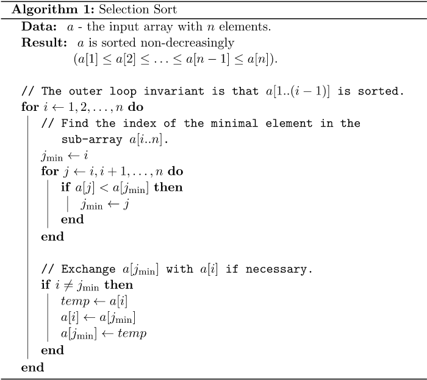
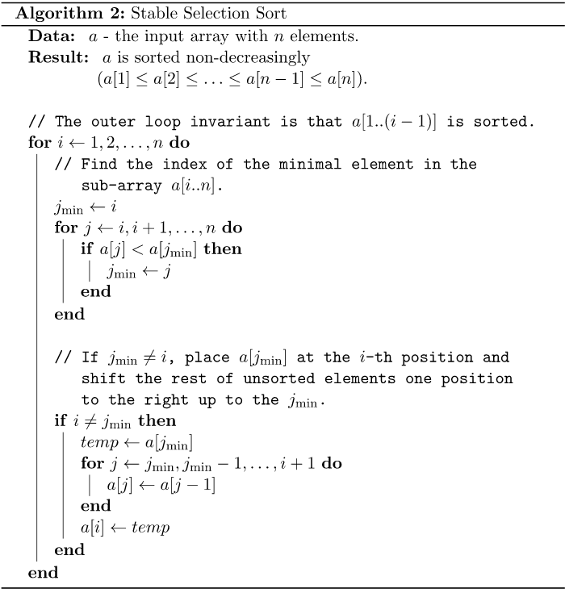
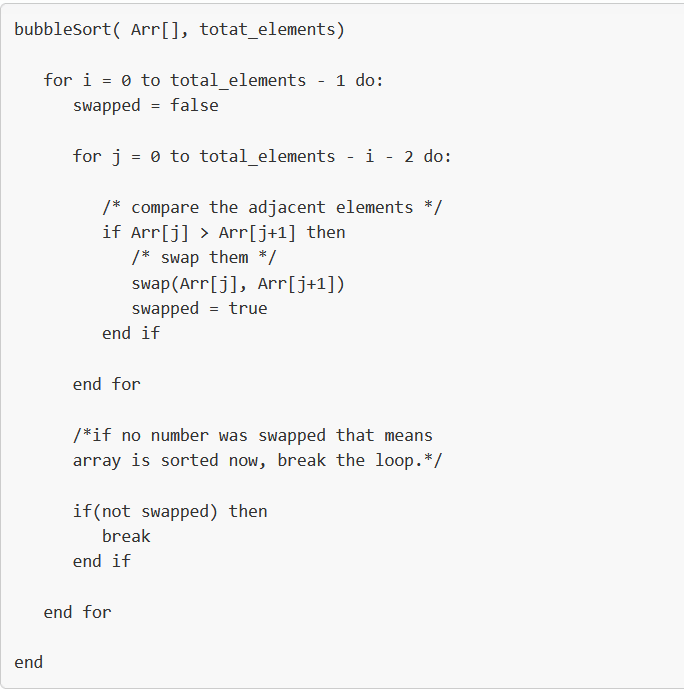
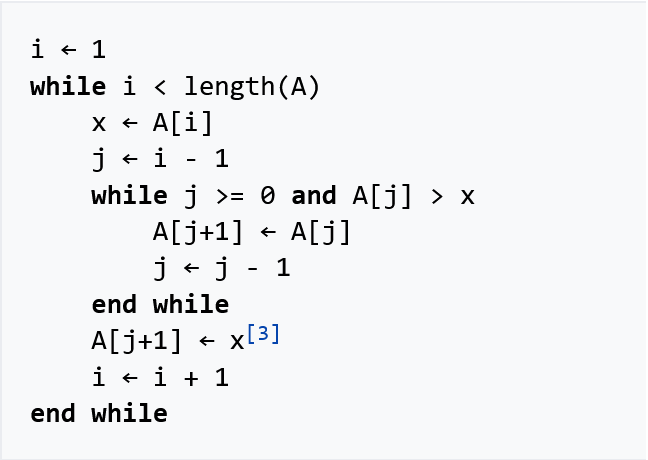
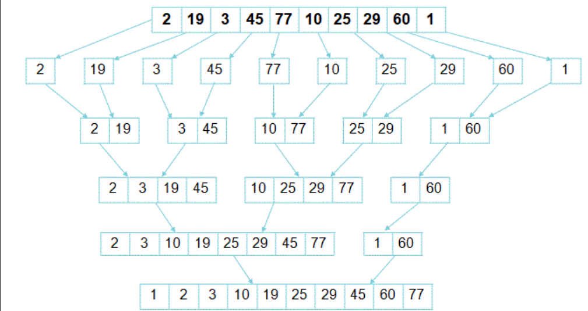

# Selection sort

The algorithm maintains two subarrays in a given array:
- an already sorted subarray
- remaining subarray which is unsorted
Initially, the sorted subarray is empty and the unsorted subarray is the whole array.

In each iteration the unsorted subarray is traversed to find the smallest element (or largest, depending on sorting order). Then this element is added to the sorted subarray by swapping it with the leftmost unsorted element.

--------------------------------
***Time Complexity O(N^2)***  
- Inefficient on large arrays.
- For each element, the entire array is checked to find the smallest element. So in the worst case, N elements are checked for each element.

***Space Complexity O(1)***  
In-place algorithm (Algorithm that does not need an extra space and produces an output in the same memory that contains the data by transforming the input ‘in-place’. However, a small constant extra space used for variables is allowed).  

***Not Stable***  
The default implementation is not stable,but it can be made stable (stable -> if two objects with equal keys appear in the same order in sorted output as they appear in the input array).

***Number of Comparisons O(N^2)***  
Every element is compared to every other element.

***Number of Swaps O(N)***  
Makes the minimum possible number of swaps, n − 1 in the worst case (the final element is already in place).  

--------------------------------

Swapping might impact in pushing smaller key to a position greater than the bigger key (keys have equal values), which makes the algorithm unstable.  
Selection sort can be made **Stable** if instead of swapping, the minimum element is placed in its position by pushing every element one step forward. In simple terms it uses Insertion sort technique. That leads to performing O(N^2) swaps

#### USE:
- When the array is NOT partially sorted;
- When we have memory usage constraints;
- When a simple sorting implementation is desired;
- When the array to be sorted is relatively small.

#### AVOID:
- When the array to be sorted has a large number of elements;
- When the array is nearly sorted;
- When you want a faster run time and memory is not a concern.
  
  
  

# Bubble sort (also known as Sinking sort)

The algorithm works by repeatedly swapping the adjacent elements if they are in the wrong order. The pass through the array is repeated until the array is sorted.

--------------------------------
***Time Complexity***  
- Worst-case and Average complexity of O(N^2);
- Best-case of O(N) , when an array is already sorted.
- [Time Complexity of Standard Bubble Sort](https://www.baeldung.com/cs/bubble-sort-time-complexity#time-complexity-analysis), 
[Time Complexity of Improved Bubble Sort](https://www.baeldung.com/cs/bubble-sort-time-complexity#2-time-complexity-of-improved-bubble-sort)

***Space Complexity O(1)***  
In-place algorithm.

***Stable algorithm*** 

***Adaptive*** 
improvedSort version is Adaptive. If the array is partially sorted (no swaps were performed), we'll terminatethe sorting early.

***Number of Comparisons (Worst case) O(N^2)***
Every element is compared to every other element.

***Number of Swaps (Worst case) O(N^2)***

--------------------------------

    
     
#### USE:
- When the array is partially sorted - since bubble sort is adaptive;
- When we have memory usage constraints;
- When a simple sorting implementation is desired;
- When the array to be sorted is relatively small.

#### AVOID:
- When the array-to-be-sorted has a large number of elements;
- When the array is completely  unsorted;
- When wanted a faster run time and memory is not a concern.

# Insertion Sort

The algorithm maintains two subarrays in a given array:
- an already sorted subarray
- remaining subarray which is unsorted
Starts with trivially sorted subarray of size 1. Picks an elements from the unsorted part and inserts it at the correct place in the sorted part (shifts all larger elements back to make space, and inserts into that correct position).

--------------------------------
***Time Complexity***
- Worst-case and Average complexity of O(N^2);
- Best-case of O(N) , when an array is already sorted (During each iteration, the element to be sorted is only compared with the right-most element of the sorted subarray.)  

***Space Complexity O(1)***
- In-place algorithm  

***Stable algorithm***
- As elements bubble to the correct position in the sorted subarray, the original relative order of equal elements is maintained. 

***Adaptive***
- Efficient for data sets that are already substantially sorted.
--------------------------------

    

**Recursive Insertion Sort** has NO performance/implementation advantages over Iterative Insertion Sort. This increases the additional memory consumption from O(1) to O(N) (at the deepest level of recursion the stack contains N references to the array, each with accompanying value of variable size from N down to 1).  
**Binary Insertion Sort** uses binary search to find the proper location to insert the selected item at each iteration. In normal insertion, sorting takes O(i) (at ith iteration) in worst case. We can reduce it to O(logi) by using binary search. The algorithm, as a whole, still has worst case running time of O(N^2) because of the series of swaps required for each insertion.

#### USE:
- When the array is nearly sorted - since insertion sort is adaptive
- When we have memory usage constraints
- When a simple sorting implementation is desired
- When the array to be sorted is relatively small
- When you need to sort elements online - that is sorting them as they come in.  

\* Insertion sort is one of the fastest algorithms for sorting very small arrays, even faster than quicksort;
Indeed, good quicksort implementations use insertion sort for arrays smaller than a certain threshold, also when arising as subproblems; the exact threshold must be determined experimentally and depends on the machine, but is commonly around ten.

#### AVOID:
- When the array to be sorted has a large number of elements
- When the array is completely  unsorted
- When you want a faster run time and memory is not a concern.

# Merge Sort
Merge Sort is a Divide-and-Conquer algorithm
- The Top-Down Merge sort approach is uses recursion mechanism. It divides the input array into two halves, calls itself for the two halves, and then merges the two sorted halves.
- The Bottom-Up Merge sort approach uses iterative methodology. It starts with the single-element arrays, combines and sorts two adjacent arrays. The combined-sorted arrays are again combined and sorted with each other until one big sorted array is achieved.

        

--------------------------------
***Time Complexity O(N logN)***
The complexity of the merge function is O(len1 + len2), where len1 is the length of the first half, and len2 is the length of the second half.
  
***Space Complexity O(N)***
- Not in-place algorithm
- Requires temporary array to store the merged and sorted subarrays. All elements are copied into an auxiliary array so N auxiliary space is required for merge sort.

***Stable algorithm***

***Not Adaptive***

--------------------------------

 

#### USE:
- Works well for larger lists
- Has a consistent running time
- Preserves the order of equal elements
- Handles slow-to-access sequential data efficiently
- The merge operation of merge sort can be implemented without extra space for linked lists.

#### AVOID:
- Slower comparative to the other sort algorithms for smaller tasks.
- The algorithm requires an additional memory space of O(N) for the temporary array.
- It goes through the whole process even if the array is sorted.

**References:**  
:point_right: [Geeks for Geeks](https://www.geeksforgeeks.org/sorting-algorithms/)  
:point_right: [Wikipedia](https://en.wikipedia.org/wiki/Sorting_algorithm)  
:point_right: [Acoders Journey](https://www.acodersjourney.com/tag/programming-interviews/)  
:point_right: [Baeldung](https://www.baeldung.com/cs/category/algorithms/sorting)  
